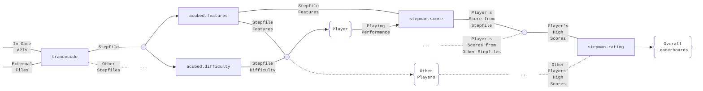

<!-- PROJECT LOGO -->

 

    <picture>
        <source srcset="assets/logo/stepman.ai/dark-mode/stepmanai.png"  media="(prefers-color-scheme: dark)">
        
    </picture>

## Introduction
Welcome to `stepman.ai`, an organization devoted to support community-driven open source vertical scroll rhythm games through machine learning and artificial intelligence. Currently, `stepman.ai` supports the following games:
  

    <a href="https://etternaonline.com/"><picture>
        <source srcset="assets/logo/etterna/dark-mode.svg"  media="(prefers-color-scheme: dark)">
        </a>
    </picture></a>ㅤ
    <a href="https://www.flashflashrevolution.com/"><picture>
        <source srcset="assets/logo/ffr/dark-mode.svg" media="(prefers-color-scheme: dark)">
        
    </picture></a>ㅤ
    <a href="https://osu.ppy.sh/"><picture>
        <source srcset="assets/logo/osumania/dark-mode.svg" media="(prefers-color-scheme: dark)">
        
    </picture></a>ㅤ
    <a href="https://quavergame.com/"><picture>
        <source srcset="assets/logo/quaver/dark-mode.svg" media="(prefers-color-scheme: dark)">
        
    </picture></a>
  

and offers modules to address several key challenges including:
- File format standardization to facilitate framework integration with `trancecode`
- Objective stepfile feature extraction and unbiased difficulty measurement with `acubed`
- Cross-platform ranked leaderboards to measure playing performance and compare player skill with `stepman`

Each module is developed using the following technological stack:

    <a href="https://www.python.org/"><picture>
        <source srcset="https://cdn.simpleicons.org/python/000/fff"  media="(prefers-color-scheme: dark)">
        </a>
    </picture></a>ㅤ
    <a href="https://github.com/features/actions"><picture>
        <source srcset="https://cdn.simpleicons.org/githubactions/000/fff"  media="(prefers-color-scheme: dark)">
        </a>
    </picture></a>ㅤ
    <a href="https://ubuntu.com/"><picture>
        <source srcset="https://cdn.simpleicons.org/ubuntu/000/fff"  media="(prefers-color-scheme: dark)">
        </a>
    </picture></a>ㅤ
    <a href="https://pypi.org/"><picture>
        <source srcset="https://cdn.simpleicons.org/pypi/000/fff"  media="(prefers-color-scheme: dark)">
        </a>
    </picture></a>ㅤ
    <a href="https://www.docker.com/"><picture>
        <source srcset="https://cdn.simpleicons.org/docker/000/fff"  media="(prefers-color-scheme: dark)">
        </a>
    </picture></a>ㅤ
    <a href="https://supabase.com/"><picture>
        <source srcset="https://cdn.simpleicons.org/supabase/000/fff"  media="(prefers-color-scheme: dark)">
        </a>
    </picture></a>ㅤ
    <a href="https://duckdb.org/"><picture>
        <source srcset="https://cdn.simpleicons.org/duckdb/000/fff"  media="(prefers-color-scheme: dark)">
        </a>
    </picture></a>ㅤ
    <a href="https://www.dotenv.org/"><picture>
        <source srcset="https://cdn.simpleicons.org/dotenv/000/fff"  media="(prefers-color-scheme: dark)">
        </a>
    </picture></a>ㅤ
    <a href="https://www.getdbt.com/"><picture>
        <source srcset="https://cdn.simpleicons.org/dbt/000/fff"  media="(prefers-color-scheme: dark)">
        </a>
    </picture></a>

and operates under the overall `stepman.ai` ecosystem depicted in the following technical diagram:

